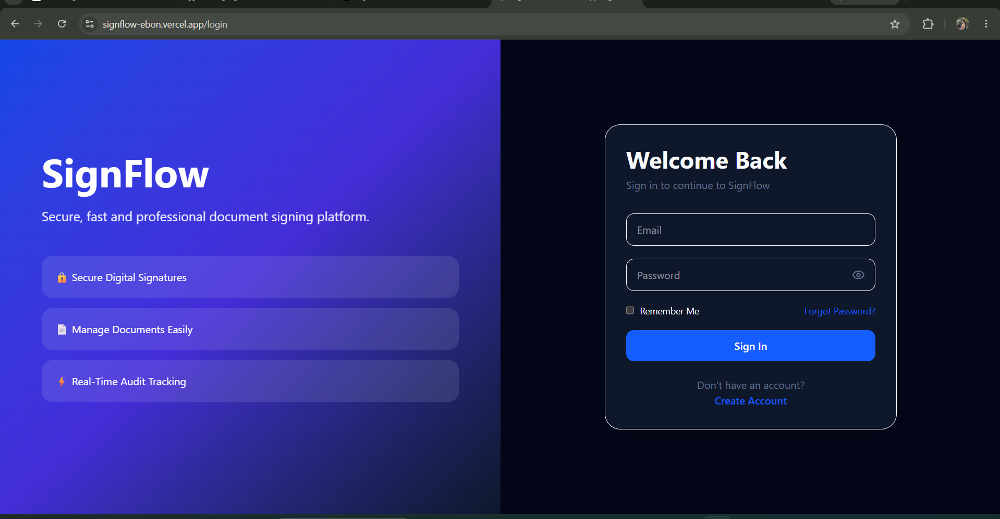
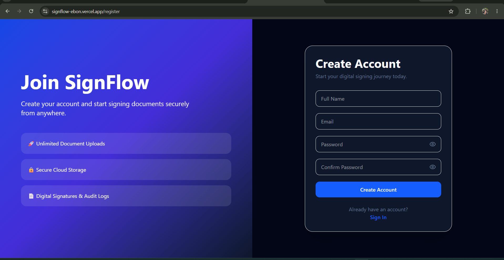
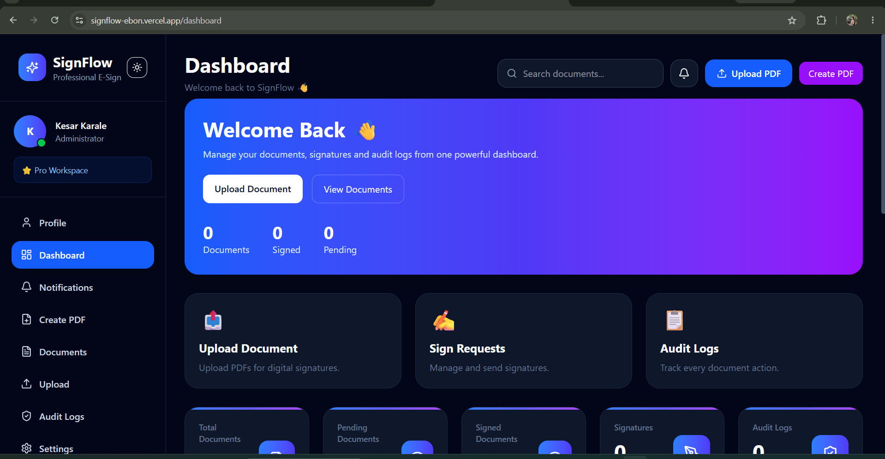
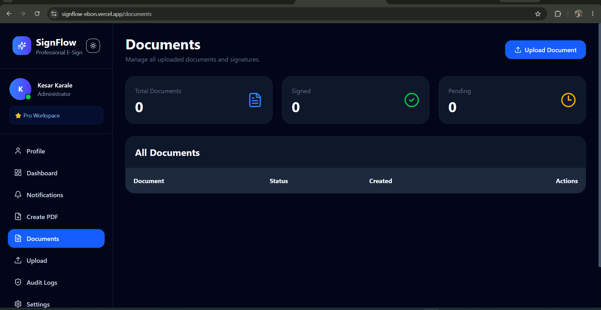
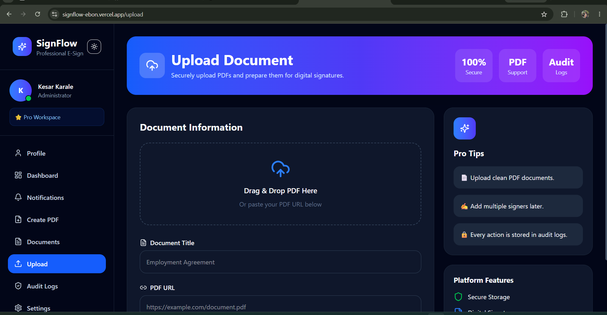

 # SignFlow ✍️

A modern digital signature platform built with Next.js, Prisma, PostgreSQL, NextAuth, Tailwind CSS, and TypeScript.

## Features

* 🔐 Secure Authentication (NextAuth)
* 👤 User Registration & Login
* 📄 Document Management
* ✍️ Digital Signature Support
* 📋 Audit Logs & Activity Tracking
* 📊 Professional Dashboard
* 🎨 Modern Responsive UI
* ⚡ Fast Performance with Next.js
* 🗄️ PostgreSQL Database with Prisma ORM

## Tech Stack

* Next.js 15
* TypeScript
* Tailwind CSS
* Prisma ORM
* PostgreSQL
* NextAuth
* Lucide Icons

## Installation

```bash
git clone https://github.com/Kesarkarale/signflow.git

cd signflow

npm install
```

Create a `.env` file:

```env
DATABASE_URL=
DIRECT_URL=
NEXTAUTH_SECRET=
NEXTAUTH_URL=
```

Generate Prisma Client:

```bash
npx prisma generate
npx prisma db push
```

Run the project:

```bash
npm run dev
```

Open:

```text
http://localhost:3000
```

## Screenshots

* **Login Page**
  


* **Register Page**
  


* **Dashboard**
  
  
  
* **Document Management**
  


* **Upload Page**
  
  

## Project Highlights

SignFlow simplifies document signing workflows by providing a secure and professional platform for managing documents, signatures, and audit records in one place.

## Author

Kesar Karale
